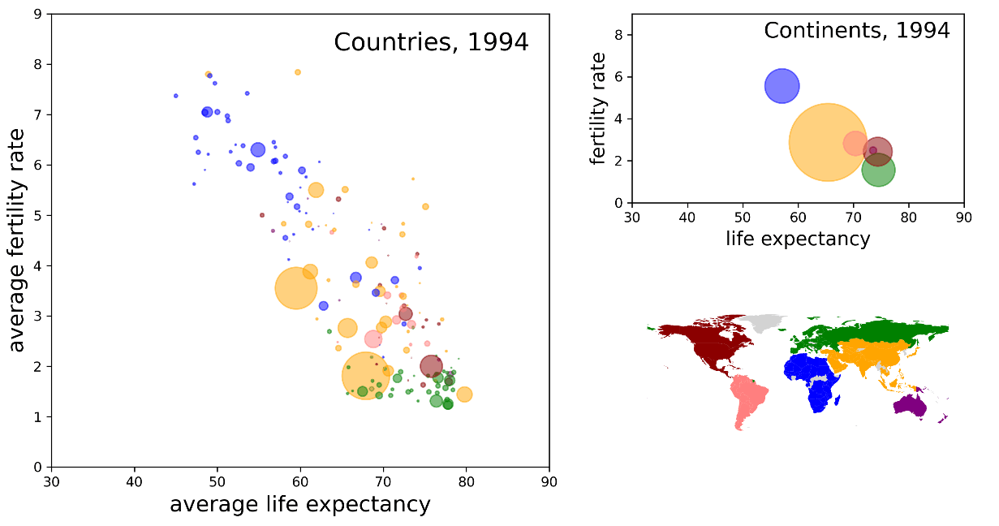

# Fertility-Visualization

This is Jupyter python code produces an animated gif visualizing a comparison of fertility rates and life expectancy across most countries the world, over a period of 55 years.
